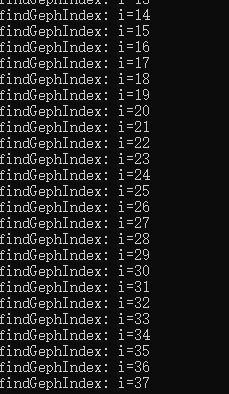
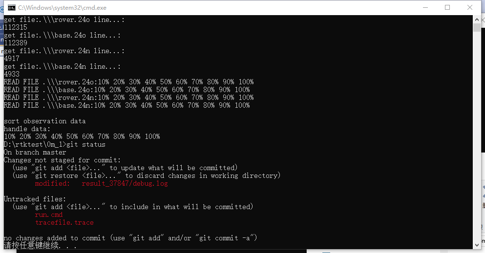
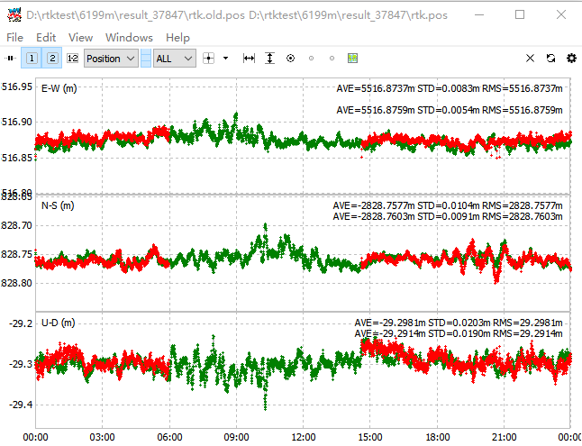
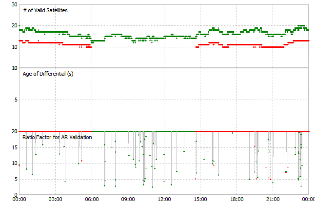
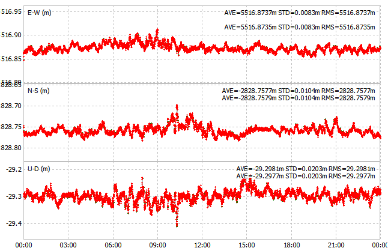

## rtk程序的输入和输出问题

首先，文件的输入文件夹是写死的

```
base.24n  base.24o  result_37847/  rover.24n  rover.24o
```

运行之后会在 result_37847/ 生成三个文件

- debug.log
- rtk.pos
- filter.pos

而在 rtk 目录下（exe生成的目录），则生成

- test.log
- configFile/config.log
- libmem.log

test.log 是用来记录一些指定的参数的数值，但实际上这个点已经可以用`trace`函数替代，无任何影响。test.log 已删除。

libmem.log 是检测内存泄漏的工具，但无输出。引入了该库但没有使用，已经删除，对结果无影响。

config.log 是项目的控制文件。已经移入项目文件夹，对结果无影响。并且改名为config.conf


----

## 文件的重复读取

代码中为了实现显示处理进程，改写了原本的函数，需要将文件预读取一遍，这是否有必要？

浪费了读取时间，其实很没必要

-----------

写死的规定

```c
	while ((file = recaddir(dir)) != NULL) {
		if (strncmp(file->d_name, ".", 1) == 0) continue;
		if (!(ext = strrchr(file->d_name, '.'))) continue;
		if (!strstr(ext, "20o") && !strstr(ext, "21o") && !strstr(ext, "o") && !strstr(ext, "22o")) continue;
		sprintf(filepath, "%s%c%s", fileDir, sep, file->d_name);
		if (indexFile > 2) {
```

为什么要此处排除20o/21o/22o呢？

--------

实际上指定基站、流动站的观测文件是件很简单的事情，直接在配置文件中写明即可，但程序中写的相当复杂，因此均以删除，项目目录里的观测文件必须以下命名

- base.24o
- rove.24o
- base.24n
- rove.24n

TODO 暂定操作，待完善

--------

trace_flag 的功能与函数，trace可以完全替代，以下内容在`trace()`均有输出

```c
	trace_flag[0] = 1; //0:定位结果
	trace_flag[1] = 1; //1:滤波后结果
	trace_flag[2] = 0; //2：单点定位结果
	trace_flag[3] = 0; //3：DOP
	trace_flag[4] = 0; //4：观测量信息
	trace_flag[5] = 0; //5：卫星位置
	trace_flag[6] = 1; //6：卫星残差
	trace_flag[7] = 0; //7：卫星仰角
	trace_flag[8] = 0; //8：多径
	trace_flag[9] = 0; //9：模糊度 电离层
	trace_flag[10] = 1;//9：调试信息
```

debug.log 实际上就是原来的trace文件

----

## `findGephIndex2()` 和 `findGephIndex()` 函数的问题。

这两个函数的定义分别是
```c
static int findGephIndex2(geph_t* geph, unsigned char sat) {
    int i;

    for (i = 0; i < MAXGEPH; i++) {
        if (geph[i].sat == 0) {
            return i;
        }
    }
    return -1;
}
```

```c
extern int findGephIndex(geph_t* geph, unsigned char sat) {
    unsigned char i;

    for (i = 0; i < MAXGEPH; i++) {
        if (geph[i].sat == sat || geph[i].sat == 0) {
            return i;
        }
    }
    return -1;
}
```
很明显这两个函数在计算 `geph` 中的星历的数量。`geph`是一个数组，如果符合`geph[i].sat == sat || geph[i].sat == 0` 的条件，则是数组的长度。两者的区别只是判定数组长度的条件不同。

并且经过验证可得，此处代码的循环的数量是逐步增长的。应该是$n(n-1)/2$次。完全没有必要



但实际上，`findGephIndex2()` 的 `geph` 只是一个单独的星历，不可能是个数组结构

而引用 `findGephIndex()`的地方，使用的是
```c
				index = findGephIndex(nav->geph, sat);
```
而此处的`nav_t nav`里面已经有对于`geph` 和 `seph` 的计数，分别是`nav.ng nav.n`。原则上是不用进行计数的。


此处代码的逻辑时，

1. 当读取星历时，`nav`是一个仓库，将单个星历入库时，只考虑自身空间是否足够，不够就扩展它。其次要对其进行计数
2. 在星历读取完成之后，去除星历中的重复历元
3. 在星历使用时，`nav`作为只读变量来使用

因此我把这两个函数删除了，恢复使用原本的函数。解决了`add_eph error` 的问题

**注意**：`rtk: nav_t`相比 `rtklib: nav_t` 是精简版本，缺少很多成员。是为了节省内存？还是引用的rtklib版本问题？

---------
## 计算进度的问题

rtk程序有个功能是显示当前读取文件或者计算的百分比。

读取文件百分比的显示，需要先用计算文件的总行数。

```c
	for (i = 0; i < indexFile; i++) {
		printf("get file:%s line...:\n", infile[i]);
		while (fgets(buf, 4096, fp[i]) != NULL)
			coutFileLine[i]++;
		printf("%d\n", coutFileLine[i]);
		rewind(fp[i]);
	}
```

事实上这个操作非常耗时，且无用，应当删除

计算进度百分比的实现，则是通过计算总的 `nepoch`来实现。但不太合理，因为 `npeoch` 是已经读取的观测值的总数，其中包含了 base rover的观测量。

更合理应该是用计算间隔、观测值时间、和观测文件的 end time 时间来估计大致的计算百分比。计算进度只是个提示，大致数字即可，不需要使用太多的计算来精确统计

---------

## 选星问题梳理

1. 截止高度角
2. 只有单频信号的卫星()
3. 地理截止高度角
4. 残差过大的卫星

-----

## 程序负载问题

如何测量程序的负载

内存
计算

----

## 当前滤波算法的问题

FFT算法能否适应截断型位移

当测站的位置突然改变，在位移上会形成一个突发性的改变。在位移序列上表现为改变前后的整体性变化。

那FFT算法还能适用吗？

在序列的断点，FFT算法是否适用

----

c语言中的运行时间计算

`clock_t` `time_t`的区别

如何计数才能最准确

time_t 是 1971/01/01 00:00:00 距离现在的秒数，最小单位为秒

GPS时 起点为1980年1月6日0h00m00s

-----

rtk 代码当中有一个计算代码运行时间的函数

```c
extern int gettimeofday(struct timeval* tp, void* tzp)
{
    time_t clock;
    struct tm tm;
    SYSTEMTIME wtm;
    GetLocalTime(&wtm);
    tm.tm_year = wtm.wYear - 1900;
    tm.tm_mon = wtm.wMonth - 1;
    tm.tm_mday = wtm.wDay;
    tm.tm_hour = wtm.wHour;
    tm.tm_min = wtm.wMinute;
    tm.tm_sec = wtm.wSecond;
    tm.tm_isdst = -1;
    clock = mktime(&tm);
    tp->tv_sec = clock;
    tp->tv_usec = wtm.wMilliseconds * 1000;
    return (0);
}
```

使用的时候则由以下代码
```c
#ifdef TIME_OUTPUT
    gettimeofday(&tvl, NULL);
    end = tvl.tv_sec * 1000.0 + tvl.tv_usec / 1000.0;
    ntime[4] = end - start;
#endif
```
其中的变量

```c
struct timeval tvl;
double start, end, ntime[10];
```

都是全局变量，但没有任何地方使用计算的`ntime`结果。因此，这些参数和代码都被删掉了。

计算程序的运行时间，其实完全不需要当前时刻的年月日，直接来使用`clock()`来获取CPU时间即可。

跟踪函数的运行时间，完全可以用`tracetime` 替代

----

lambda() 里面的

thresDet thresP 是两个局部变量，其赋值是内部自定义的。

----

ddres() 有可能返回值为-2，


----

differHeight 有什么用？

----------

太多的临时设置和参数遗留在代码当中

------------

## rtk代码的主要问题

rtk 程序已经全部看完，掌握其主要的工作流程和基本思路。

目前来说，该代码能够解算短基线的数据。但是存在两个主要问题

0. 需要梳理诸多函数内的阈值，要么将其删除，要么将其改写成某个参数由配置文件控制
1. 长基线解算结果的确定
2. 复杂场景下的短基线结果

接下来我打算重新编写一些函数

1. 将snr，频率，两站之间的高差等一系列的阈值规划
2. 改写高度角方位角的选星策略
3. 将原版的rtklib增加
4. 根据残差进行筛选星的 部分也需要完善。

以上功能的实现将基于现有函数和流程。以增加函数或者改写函数内容的形式进行。尽量做到低耦合。

----------

## log/trace文件的处理

rtk程序当中，有一大串的resp.log，如下

```c
        sprintf(outFileName, "%s%c%s", outDir, sep, "resp.log");
        oFile.resp = fopen(outFileName, "w");
        sprintf(outFileName, "%s%c%s", outDir, sep, "resc1.log");
        oFile.resc1 = fopen(outFileName, "w");
        sprintf(outFileName, "%s%c%s", outDir, sep, "resp1.log");
        oFile.resp1 = fopen(outFileName, "w");
        sprintf(outFileName, "%s%c%s", outDir, sep, "resc2.log");
        oFile.resc2 = fopen(outFileName, "w");
        sprintf(outFileName, "%s%c%s", outDir, sep, "resp2.log");
        oFile.resp2 = fopen(outFileName, "w");
        sprintf(outFileName, "%s%c%s", outDir, sep, "resc3.log");
        oFile.resc3 = fopen(outFileName, "w");
        sprintf(outFileName, "%s%c%s", outDir, sep, "resp3.log");
        oFile.resp3 = fopen(outFileName, "w");
        sprintf(outFileName, "%s%c%s", outDir, sep, "resc4.log");
        oFile.resc4 = fopen(outFileName, "w");
        sprintf(outFileName, "%s%c%s", outDir, sep, "resc5.log");
        oFile.resc5 = fopen(outFileName, "w");
        sprintf(outFileName, "%s%c%s", outDir, sep, "resc6.log");
        oFile.resc6 = fopen(outFileName, "w");
        sprintf(outFileName, "%s%c%s", outDir, sep, "resp4.log");
        oFile.resp4 = fopen(outFileName, "w");
        sprintf(outFileName, "%s%c%s", outDir, sep, "resp5.log");
        oFile.resp5 = fopen(outFileName, "w");
        sprintf(outFileName, "%s%c%s", outDir, sep, "resp6.log");
```

实际上我们可以简单地改写trace函数即可实现log文件的分流。log/trace文件的大小，往往很难精确获取。为了控制log文件的大小，一般可以

1. **运行时间**，对于一个连续运行的rtk程序，将2h/6h/12h等间隔的记录保存成一个文件，也可以避免单个文件过大的问题

这个在rtklib里面已经实现，`traceswap()` 函数。

rtklib.h 中已经定义了 tracefile 的时间间隔，可以将其改小
```c
#define INT_SWAP_TRAC 86400.0           /* swap interval of trace file (s) */
#define INT_SWAP_STAT 86400.0           /* swap interval of solution status file (s) */
```
traceswap()的定义如下
```c
static void traceswap(void)
{
    gtime_t time = utc2gpst(timeget());
    char path[1024];

    lock(&lock_trace);

    if ((int)(time2gpst(time, NULL) / INT_SWAP_TRAC) ==
        (int)(time2gpst(time_trace, NULL) / INT_SWAP_TRAC)) {
        unlock(&lock_trace);
        return;
    }
    time_trace = time;

    if (!reppath(file_trace, path, time, "", "")) {
        unlock(&lock_trace);
        return;
    }
    if (fp_trace) fclose(fp_trace);

    if (!(fp_trace = fopen(path, "w"))) {
        fp_trace = stderr;
    }
    unlock(&lock_trace);
}
```

当使用**正则表达式**将tracefile的名称定义为 `trace-%%M.trace`时，rtklib则会在运行的每分钟新建一个文件。如下，每分钟的文件的大小约为 77M。

```bash
-rw-r--r-- 1 lex li 197121  23M Jun 20 14:23 tracefile-23.trace
-rw-r--r-- 1 lex li 197121  77M Jun 20 14:24 tracefile-24.trace
-rw-r--r-- 1 lex li 197121  77M Jun 20 14:25 tracefile-25.trace
-rw-r--r-- 1 lex li 197121 5.1M Jun 20 14:25 tracefile-26.trace
```

2. **行数**，当一个trace文件的行数达到一定的数值，则新建一个文件。这个方法控制了文件的大小

rtklib里面没有实现这个功能。如果需要，对`traceswap()` 稍加修改即可实现


------

## myFile_t

rtk 当中使用`myFile_t`来储存各种信息。
```c
typedef struct {
	FILE* spppos_r;
	FILE* spppos_b;
	FILE* pdop1;
	FILE* pdop2;
	FILE* elev;
	FILE* resp;
	FILE* resc1;
	FILE* resc2;
	FILE* resp2;
	FILE* resc3;
	FILE* resp3;
	FILE* resc4;
	FILE* resc5;
	FILE* resc6;
	FILE* resp4;
	FILE* resp5;
	FILE* resp6;
	FILE* mp1;
	FILE* mp2;
	FILE* gf; //GF周跳探测量
	FILE* mw; //MW周跳探测量
	FILE* lp; //载波减伪距法周跳探测量
	FILE* ambN1;
	FILE* ambN2;
	FILE* ambN3;
	FILE* ion;
	FILE* trop;
	FILE* P1;
	FILE* P2;
	FILE* L1;
	FILE* L2;
	FILE* fpDebug;
	FILE* navini;
	FILE* fpOut[2];
} myFile_t;
```

其实，这些信息都可以储存到trace文件中，只需要组合成特定语句，如

```bash
MP1, G01, 2024-10-10 00:00:00 100 # 这里只是个实例
```

一个大的trace文件，通过工具过滤，即可将需要的信息提取出来，如

```bash
cat trace.trace |grep MP1 > MP1.trace
```
原本的代码已经能够很好地处理文件的打开、重命名、交换等功能，每次使用时，trace都能按照我们的要求将内容存好。因此我们不需要分心对文件控制。如下的控制变量都可以删除

```c
unsigned char outflag = 0;
```

这样一方面能方便地禁用全部调试信息，也可以高效地分析项目信息。

-----

## 批量自动处理

rtk已经被我改成通过命令行来读取文件夹，因此我可以在测试目录当中，放置一个run.cmd，直接调用exe进行处理

```cmd
..\\..\\MXT2105\\rtk\\x64\\Debug\\rtk.exe -dir .\\
git status
@pause
```

运行结果，显示之前的改动对pos文件没有改动，对trace文件和debug.log有影响



-----------------

## 如何排除卫星

在`postpos.c:procpos()`当中，如下代码进行卫星的排除工作

```c
        /* exclude satellites */
        for (i=n=0;i<nobs;i++) {
            if ((satsys(obs[i].sat,NULL)&popt->navsys)&&
                popt->exsats[obs[i].sat-1]!=1) obs[n++]=obs[i];
        }
        if (n<=0) continue;
```

这段的意思是，当前历元有nobs个观测值，逐个进行筛选。如果

- 卫星的系统不对
- 用户已经指定排除该课卫星 `exsats`

则将其移到队列前面，即为`n++`位置。

而 rtk 里的这部分改写为
```c

        for (i = n = 0; i < nobs; i++) {
            sys = satsys(obs[i].sat, &prn);
            if (!(g_rtk.opt.sys & 1) && sys == SYS_GPS) continue;
            if (!(g_rtk.opt.sys & 2) && sys == SYS_QZS)continue;
            if (!(g_rtk.opt.sys & 4) && sys == SYS_BDS)continue;
            if (!(g_rtk.opt.sys & 8) && sys == SYS_GAL)continue;
            if (!(g_rtk.opt.sys & 16) && sys == SYS_GLO)continue;
            if (sys == SYS_GPS && g_rtk.opt.gpsMask>=0) {
                if (!((g_rtk.opt.gpsMask >> (prn - 1)) & 1)) continue;
            }
            if (sys == SYS_QZS && g_rtk.opt.qzssMask>=0) {
                if (!((g_rtk.opt.qzssMask >> (prn - MINPRNQZS- 1)) & 1)) continue;
            }
            if (sys == SYS_BDS && g_rtk.opt.bdsMask >= 0) {
                if (!((g_rtk.opt.bdsMask >> (prn - 1)) & 1)) continue;
            }
            if (sys == SYS_GAL && g_rtk.opt.galieoMask >= 0) {
                if (!((g_rtk.opt.galieoMask >> (prn - 1)) & 1)) continue;
            }
            if (sys == SYS_GLO && g_rtk.opt.glonassMask >= 0) {
                if (!((g_rtk.opt.glonassMask >> (prn - 1)) & 1)) continue;
            }

            /*Set frequency*/
            if (!(g_rtk.opt.freq & 1))
            {
                obs[i].P[0] = obs[i].L[0] = obs[i].D[0] = 0.0;
            }
            //else {
            //	if (obs[i].P[0] == 0.0 || obs[i].L[0] == 0.0 || obs[i].SNR[0] < g_rtk.opt.cn0Min * 4)
            //		continue;
            //}
            if (!(g_rtk.opt.freq & 2))
            {
                obs[i].P[1] = obs[i].L[1] = obs[i].D[1] = 0.0;
            }
            //else {
            //	if (obs[i].P[1] == 0.0 || obs[i].L[1] == 0.0 || obs[i].SNR[1] < g_rtk.opt.cn0Min * 4)
            //		continue;
            //}
            if (!(g_rtk.opt.freq & 4))
            {
                obs[i].P[2] = obs[i].L[2] = obs[i].D[2] = 0.0;
            }
            //else {
            //	if (obs[i].P[2] == 0.0 || obs[i].L[2] == 0.0 || obs[i].SNR[2] < g_rtk.opt.cn0Min * 4)
            //		continue;
            //}
            if (!(g_rtk.opt.freq & 8))
            {
                obs[i].P[3] = obs[i].L[3] = obs[i].D[3] = 0.0;
                obs[i].P[4] = obs[i].L[4] = obs[i].D[4] = 0.0;
                obs[i].P[5] = obs[i].L[5] = obs[i].D[5] = 0.0;
            }
            //else {
            //	if (obs[i].P[3] == 0.0 || obs[i].L[3] == 0.0 || obs[i].SNR[3] < g_rtk.opt.cn0Min * 4)
            //		continue;
            //	if (obs[i].P[4] == 0.0 || obs[i].L[4] == 0.0 || obs[i].SNR[4] < g_rtk.opt.cn0Min * 4)
            //		continue;
            //	if (obs[i].P[5] == 0.0 || obs[i].L[5] == 0.0 || obs[i].SNR[5] < g_rtk.opt.cn0Min * 4)
            //		continue;
            //}
            cnt = 0;
            if (sys == SYS_BDS) {
                for (f = 0; f < NFREQ; f++) {
                    if (obs[i].P[f] != 0.0) cnt++;
                }
                for (f = 0; f < NFREQ; f++) {
                    if (cnt >= 2 && f >= 3)
                        obs[i].P[f] = obs[i].L[f] = 0.0;
                }
            }
            for (f = 0; f < NFREQ; f++)
                obs[i].LockTime[f] = 3000;
            obs[n++] = obs[i];
        }

```

rtk的这部分代码有3个目的

1. 卫星的系统不对
2. 用户指定排除卫星，但是用gpsmask, qzssmask等变量，有点多余和重复
3. 根据频率进行排除，不要单频或者某些频率的卫星

-------------

接下来的代码

```c
        nu = i;
        nr = n - nu;
        if (g_baseObsSyncIndex >= 10)
            g_baseObsSyncIndex = 0;
        g_nbaseObsSync[g_baseObsSyncIndex] = 0;
        for (i = nu; i < nu + nr; i++) {
            g_baseObsSync[g_baseObsSyncIndex][i - nu] = obs[i];
            g_nbaseObsSync[g_baseObsSyncIndex]++;
        }
        g_baseObsSyncIndex++;
        //-----------------------------find the closest time--------------------
        dtMin = 9999.9;
        dtMinIndex = -1;
        if (nu > 0) {
            for (j = 0; j < 10; j++) {
                dt[j] = timediff(g_baseObsSync[j][0].time, obs[0].time);
                if (fabs(dt[j]) < fabs(dtMin)) {
                    dtMin = dt[j];
                    dtMinIndex = j;
                }
            }
            if (dtMinIndex != -1) {
                for (i = 0; i < g_nbaseObsSync[dtMinIndex]; i++) {
                    obs[nu + i] = g_baseObsSync[dtMinIndex][i];
                }
                n = nu + g_nbaseObsSync[dtMinIndex];
            }
        }

```
是用来检查观测值序列的时间是否相近。但这步不该在这里做。不管是从一个大的数据集中抽取，还是从实时数据流中抽取观测值，结束抽取时应当保证抽取出的观测值的时间相近。这步已经完成了抽取，那么应当假设时间合适的obs已经被取出。否则，如果检查出下个历元的数据在此处的`obs`数组当中，那么该如何处理，是覆盖掉，还是抽出来放回？？


obs数组的结构体是`obsd_t`，下面是其定义

```c
typedef struct {                 /* observation data record */
    gtime_t time;                /* receiver sampling time (GPST) */
    char id[4];
    uint8_t sat,rcv;             /* satellite/receiver number */
    uint16_t SNR[NFREQ+NEXOBS];  /* signal strength (0.001 dBHz) */
    uint8_t  LLI[NFREQ+NEXOBS];  /* loss of lock indicator */
    uint8_t code[NFREQ+NEXOBS];  /* code indicator (CODE_???) */
    double L[NFREQ+NEXOBS];      /* observation data carrier-phase (cycle) */
    double P[NFREQ+NEXOBS];      /* observation data pseudorange (m) */
    float  D[NFREQ+NEXOBS];      /* observation data doppler frequency (Hz) */
    int timevalid;               /* time is valid (Valid GNSS fix) for time mark */
    gtime_t eventime;            /* time of event (GPST) */
    uint8_t qualL[NFREQ+NEXOBS]; /* quality of carrier phase measurement */
    uint8_t qualP[NFREQ+NEXOBS]; /* quality of pseudorange measurement */
    uint8_t freq;                /* GLONASS frequency channel (0-13) */
    double simParm[3]          ; /* simulation value of [0]bias,[1]iono [2]trop */
} obsd_t;
```

因此我们可以计算基准站与流动站的测站数量，如果nr<=4 或者nu<=4，确实没必要进行下一步的计算。

此处进行卫星的删除是合适的。直接减少观测值的数量$n$，可以有效减少后续的计算要求。也可以将**非共视卫星**在RTK模式中进行删除，减小数量$n$。

70m_0数据集中，单个历元中两个测站观察到的卫星数量可能是42:23，那么**删除非共视卫星**就非常有必要。

请注意此处的obs数组排序是经过`sortobs()`排序后的数据。因此先是流动站的数据，接下来是基准站的数据，卫星的序号排列也具有先后顺序。

但是此处不应该按照SNR删除卫星，因为每个卫星有多个频点，因为单个频点的SNR较差而拒绝整个卫星的观测值。

也不应该按频率删除卫星。只有单频信号的卫星也可以与组合频率的卫星组方程计算。


## 排除卫星代码的结果对比

我们删除了main.c的一些代码，提交编号为


这是前后的结果对比



这是前后的结果统计，ENU三个方向上的STD统计值



现在的有以下几个问题

1. 旧方法经过卫星排除后，使用的卫星更多，而新方法的卫星更少。那新方法到底排除了那些卫星呢?
2. 旧方法使用的卫星更多，但精度稍差一点，这是为什么？
    并不是用的卫星越多，精度越高
3. 按照理论来说，旧方法的筛选准则更加严格，为什么旧方法反而选取了更多的卫星？
    旧方法使用了GPS+BDS，而新方法是因为SYS预编译头的改写，导致只筛选了BDS卫星

## rtk中的rtk.h

其中有这样一段代码

```c
//#define SYS_NONE    0x00                /* navigation system: none */
//#define SYS_GPS     0x01                /* navigation system: GPS */
//#define SYS_SBS     0x02                /* navigation system: SBAS */
//#define SYS_GLO     0x04                /* navigation system: GLONASS */
//#define SYS_GAL     0x08                /* navigation system: Galileo */
//#define SYS_QZS     0x10                /* navigation system: QZSS */
//#define SYS_BDS     0x20                /* navigation system: BeiDou */
//#define SYS_LEO     0x40                /* navigation system: LEO */
//#define SYS_ALL     0xFF                /* navigation system: all */

#define SYS_GPS     (0)                   /* navigation system: GPS */
#define SYS_QZS     (1)                   /* navigation system: QZSS */
#define SYS_BDS     (2)                   /* navigation system: BeiDou */
#define SYS_GLO     (4)                   /* navigation system: GLONASS */
#define SYS_GAL     (3)                   /* navigation system: Galileo */
#define SYS_SBS     0x10                /* navigation system: SBAS */
#define SYS_LEO     0x40                /* navigation system: LEO */
#define SYS_NONE    0xFF                /* navigation system: none */
#define SYS_ALL     0xFF                /* navigation system: all */
```

为什么`SYS_NONE` `SYS_ALL`都改成了`0xFF`？这样两者不是混乱了？代码中任何使用`&`操作来判定系统的地方，都有能是错误的。

原版的设置(上面注释掉的部分)，可以简单地通过下面的代码来判断某颗卫星是否符合要求的系统

```c
satsys(obs[i].sat, NULL) & rtk.opt.sys //如果符合应该返回 1
```
这样的操作采用的是 `&` 位运算，是比其他判断语句更快的方式。而rtk中判断系统的方式则是

```c
            sys = satsys(obs[i].sat, &prn);
            if (!(g_rtk.opt.sys & 1) && sys == SYS_GPS)continue;
            if (!(g_rtk.opt.sys & 2) && sys == SYS_QZS)continue;
            if (!(g_rtk.opt.sys & 4) && sys == SYS_BDS)continue;
            if (!(g_rtk.opt.sys & 8) && sys == SYS_GAL)continue;
            if (!(g_rtk.opt.sys & 16) && sys == SYS_GLO)continue;
```
我个人感觉这个方法不是很好。

所以我把上面的代码重新恢复了

```c
#define SYS_NONE    0x00                /* navigation system: none */
#define SYS_GPS     0x01                /* navigation system: GPS */
#define SYS_SBS     0x02                /* navigation system: SBAS */
#define SYS_GLO     0x04                /* navigation system: GLONASS */
#define SYS_GAL     0x08                /* navigation system: Galileo */
#define SYS_QZS     0x10                /* navigation system: QZSS */
#define SYS_BDS     0x20                /* navigation system: BeiDou */
#define SYS_LEO     0x40                /* navigation system: LEO */
#define SYS_ALL     0xFF                /* navigation system: all */
```

其次，删除了下面`main.c`的这些代码
```c
        /* exclude satellites */

        for (i = n = 0; i < nobs; i++) {
           sys = satsys(obs[i].sat, &prn);
           if (!(g_rtk.opt.sys & 1) && sys == SYS_GPS)continue;
           if (!(g_rtk.opt.sys & 2) && sys == SYS_QZS)continue;
           if (!(g_rtk.opt.sys & 4) && sys == SYS_BDS)continue;
           if (!(g_rtk.opt.sys & 8) && sys == SYS_GAL)continue;
           if (!(g_rtk.opt.sys & 16) && sys == SYS_GLO)continue;
           if (sys == SYS_GPS && g_rtk.opt.gpsMask>=0) {
               if (!((g_rtk.opt.gpsMask >> (prn - 1)) & 1)) continue;
           }
           if (sys == SYS_QZS && g_rtk.opt.qzssMask>=0) {
               if (!((g_rtk.opt.qzssMask >> (prn - MINPRNQZS- 1)) & 1)) continue;
           }
           if (sys == SYS_BDS && g_rtk.opt.bdsMask >= 0) {
               if (!((g_rtk.opt.bdsMask >> (prn - 1)) & 1)) continue;
           }
           if (sys == SYS_GAL && g_rtk.opt.galieoMask >= 0) {
               if (!((g_rtk.opt.galieoMask >> (prn - 1)) & 1)) continue;
           }
           if (sys == SYS_GLO && g_rtk.opt.glonassMask >= 0) {
               if (!((g_rtk.opt.glonassMask >> (prn - 1)) & 1)) continue;
           }

           /*Set frequency*/
           if (!(g_rtk.opt.freq & 1))
           {
               obs[i].P[0] = obs[i].L[0] = obs[i].D[0] = 0.0;
           }
           //else {
           //	if (obs[i].P[0] == 0.0 || obs[i].L[0] == 0.0 || obs[i].SNR[0] < g_rtk.opt.cn0Min * 4)
           //		continue;
           //}
           if (!(g_rtk.opt.freq & 2))
           {
               obs[i].P[1] = obs[i].L[1] = obs[i].D[1] = 0.0;
           }
           //else {
           //	if (obs[i].P[1] == 0.0 || obs[i].L[1] == 0.0 || obs[i].SNR[1] < g_rtk.opt.cn0Min * 4)
           //		continue;
           //}
           if (!(g_rtk.opt.freq & 4))
           {
               obs[i].P[2] = obs[i].L[2] = obs[i].D[2] = 0.0;
           }
           //else {
           //	if (obs[i].P[2] == 0.0 || obs[i].L[2] == 0.0 || obs[i].SNR[2] < g_rtk.opt.cn0Min * 4)
           //		continue;
           //}
           if (!(g_rtk.opt.freq & 8))
           {
               obs[i].P[3] = obs[i].L[3] = obs[i].D[3] = 0.0;
               obs[i].P[4] = obs[i].L[4] = obs[i].D[4] = 0.0;
               obs[i].P[5] = obs[i].L[5] = obs[i].D[5] = 0.0;
           }
           //else {
           //	if (obs[i].P[3] == 0.0 || obs[i].L[3] == 0.0 || obs[i].SNR[3] < g_rtk.opt.cn0Min * 4)
           //		continue;
           //	if (obs[i].P[4] == 0.0 || obs[i].L[4] == 0.0 || obs[i].SNR[4] < g_rtk.opt.cn0Min * 4)
           //		continue;
           //	if (obs[i].P[5] == 0.0 || obs[i].L[5] == 0.0 || obs[i].SNR[5] < g_rtk.opt.cn0Min * 4)
           //		continue;
           //}
           //cnt = 0;
           //if (sys == SYS_BDS) {
           //    for (f = 0; f < NFREQ; f++) {
           //        if (obs[i].P[f] != 0.0) cnt++;
           //    }
           //    for (f = 0; f < NFREQ; f++) {
           //        if (cnt >= 2 && f >= 3)
           //            obs[i].P[f] = obs[i].L[f] = 0.0;
           //    }
           //}
           for (f = 0; f < NFREQ; f++)
               obs[i].LockTime[f] = 3000;
           obs[n++] = obs[i];
        }


        for (i = 0; i < n; i++) {
           if (obs[i].rcv != 1)
               break;
        }
        nu = i;
        nr = n - nu;
```

代之以下面这样的代码


```c
        nu = 0;
        nr = 0;

        for (i = n = 0; i < nobs; i++) {
            if ((satsys(obs[i].sat, NULL) & g_rtk.opt.sys) &&
                g_rtk.opt.exsats[obs[i].sat - 1] != 1) {
                obs[n++] = obs[i];
                if (obs[n].rcv == 1)
                    nu++;
                else if (obs[n].rcv == 2)
                    nr++;
                for (f = 0; f < NFREQ; f++)
                    obs[n].LockTime[f] = 3000;
            }
        }
```

两者结果完全一致。历元间的位置差异在$<1mm$


## 节省内存的方法

在不更改rtklib的框架情况下，可以有以下方法来减少内存的占用

1. `obs_t` ` nav_t`结构体在存储$nmax$个观测值时，如果发现已申请的内存不够，会重新申请$2*nmax$数量的内存。这会造成$nmax+1$观测值也会申请$2nmax$个内存。这是个巨大的浪费，尤其是$n$很大的情况下。
2. 通过预编译头来限制卫星的数量和频率，可以有效减少内存的消耗
3. 通过规范变量的属性，在不改变代码结果的情况下，可以节省变量占用的内存。如将`int`类型改为`short int`
4. 整理流程，将部分可能多次重新计算的结果进行保存，比如`zdres()` `ddres()`当中，有很多变量都会多次计算，这部分也有优化的空间。

5. 在进入`rtkpos()`函数之前，就对观测值进行筛选，可以有效减少观测值的数量。
6. 对于使用`for`循环赋值的地方，尽量改用`memset()`等函数

## 观测值的时间对齐问题

下面这些代码是对其观测值的时间，但实际上这个工作在`inputobs()`中已经做了。不需要下面这些代码来实现。因此删除。对结果无影响

```c

        if (g_baseObsSyncIndex >= 10)
           g_baseObsSyncIndex = 0;
        g_nbaseObsSync[g_baseObsSyncIndex] = 0;
        for (i = nu; i < nu + nr; i++) {
           g_baseObsSync[g_baseObsSyncIndex][i - nu] = obs[i];
           g_nbaseObsSync[g_baseObsSyncIndex]++;
        }
        g_baseObsSyncIndex++;
        //-----------------------------find the closest time--------------------
        dtMin = 9999.9;
        dtMinIndex = -1;
        if (nu > 0) {
           for (j = 0; j < 10; j++) {
               dt[j] = timediff(g_baseObsSync[j][0].time, obs[0].time);
               if (fabs(dt[j]) < fabs(dtMin)) {
                   dtMin = dt[j];
                   dtMinIndex = j;
               }
           }
           if (dtMinIndex != -1) {
               for (i = 0; i < g_nbaseObsSync[dtMinIndex]; i++) {
                   obs[nu + i] = g_baseObsSync[dtMinIndex][i];
               }
               n = nu + g_nbaseObsSync[dtMinIndex];
           }
        }
```

## ssat的赋值

```c
    for (i = 0; i < MAXSAT; i++) {
       rtk->ssat[i].vs = 0;
       rtk->ssat[i].quickSelSatDel = 0;
       rtk->ssat[i].azel[0][0] = rtk->ssat[i].azel[0][1] = 0.0;
       rtk->ssat[i].azel[1][0] = rtk->ssat[i].azel[1][1] = 0.0;
       rtk->ssat[i].rs[0] = 0.0;
       rtk->ssat[i].rs[1] = 0.0;
       rtk->ssat[i].rs[2] = 0.0;
       rtk->ssat[i].fixWL = 0;
       rtk->ssat[i].fixNL = 0;
       for (f = 0; f < NFREQ; f++) {
           rtk->ssat[i].ddAmb[f] = 9999.99; // 此处应该改成0
           rtk->ssat[i].resc[f] = 0.0;
       }
    }
```

这里的`ddAmb`的默认值设置为9999.9。我经过验证似乎没有必要。双差模糊度等于0，是很正常的事情，而且对后续ddAmb的使用没有影响，因此可以改为0。我经过验证，改成0之后定位结果没有影响。因此可以改成0。

那既然可以改成0，那么上述代码可以精简为一句话。不仅保证上述指定的变量会被重置为0，而且保证了其他变量也会重置为0，并且速度更快，一次内存操作即可完成。

```c
    memset(rtk->ssat, 0, sizeof(ssat_t) * MAXSAT);
```

## rtkpos()中的函数简化

下面的代码是为了统计两个测站的观测值数量

```c
    for (i = 0; i < n; i++) {
        if (obs[i].rcv != 1)
            break;
    }
    nu = i;//number of rover observations
    nr = n - nu;
    if (nu == 0) {
        printf("fe\n");
    }
    trace(1, "nu=%d nr=%d\n", nu, nr);
    if (nu < 4) {
        resetRtk(rtk, SOLQ_NONE);
        free(rs); free(dts); free(var);
        //trace(2, "no rover data:%d\n", nu);
        return 1;
    }
    trace(1, "rover time=%ld\n", obs[0].time.time);
    if (nr > 0)
        trace(1, "base  time=%ld\n", obs[nu].time.time);
```
上述代码可以简化为

```c
    for (i = 0; i < n; i++) {
        if (obs[n].rcv == 1)
            nu++;
        else if (obs[n].rcv == 2)
            nr++;
    }

    if (nu < 4 || nr<4 ) {
        resetRtk(rtk, SOLQ_NONE);
        free(rs); free(dts); free(var);
        //trace(2, "no rover data:%d\n", nu);
        return 1;
    }
```

## rtk的星历更新机制

rtk里面没有使用原始的动态增加星历的模式，而是采用了固定数量的星历数组，这个数量定义如下

```c
#define MAXEPH		10240
#define MAXGEPH     5120
```

目前有两个问题
1. 这个数量有点大

    在一个2024/05/28-2024/06/04共8天的数据当中，大概有 11043 个星历。那么如果我只计算1天的数据，这个数量有点大。如果计算更长时间的，比如10天，这个数量又不够。

2. 在实时程序当中，首先，实时计算肯定不需要存储前8天的星历，在内存中储存前 2-6h 的数据就行了。但需要不断更新最新的星历，删除旧的。那rtk里面是如何更新星历数据的？

## relpos 当中，ilterCout 的最大数量是5

但rtklib中默认次数是 2。我们来看一下最大的区别，以70m的基线为例

| max_ilterCout |E(cm)| N(cm) | U(cm) |
|-|-|- |-|
|1 | 0.80| 0.59| 1.89 |
|2 | 0.73| 0.52| 1.58 |
|3 | 0.71| 0.50| 1.51 |
|4 | 0.71| 0.50| 1.50 |
|5 | 0.71| 0.50| 1.50 |
|10 | 0.72| 0.50| 1.53 |

边际递减效应，应该以位移的改进率为终结循环的依据。

## `relpos()`内的while 循环流程图

```mermaid

```

## 针对 `pntpos.c` 中`update_state()` 的改动说明

```c
static void update_state(const prcopt_t* opt, int base, int n, obsd_t* obs, ssat_t* ssat, int* vsat, double* resp, double* azel_) {
    int i, j, k, index;
    unsigned char sys, prn;
    double lam[NFREQ];
    for (i = 0; i < n; i++)
    {
        sys = satsys(obs[i].sat, &prn);
        if (sys == SYS_QZS || sys == SYS_GLO) {
            ssat[obs[i].sat - 1].vs = -1;
            continue;
        }

        getWavelength(sys, prn, lam);

        if (base == 0) {
            ssat[obs[i].sat - 1].azel[0][0] = azel_[i * 2];
            ssat[obs[i].sat - 1].azel[0][1] = azel_[1 + i * 2];
            index = obs[i].pvtAvalidPsrIndex;
            if (index == -1) continue;
            if (!vsat[i]) {
                ssat[obs[i].sat - 1].vs = -1;
                continue;
            }
            if (obs[i].P[index] == 0.0 || obs[i].L[index] == 0.0) {
                ssat[obs[i].sat - 1].vs = -1;
            }
            for (j = 0; j < NFREQ; j++) {
                if (obs[i].SNR[j] < 33 * 4) {
                    obs[i].P[j] = obs[i].L[j] = 0;
                }
            }
            if ((ssat[obs[i].sat - 1].slip[0] & 1) || (ssat[obs[i].sat - 1].slip[0] & 2)) {
                ssat[obs[i].sat - 1].vs = -1;
                continue;
            }
            if (fabs(obs[i].P[index] - obs[i].L[index] * lam[index]) > 1000) {
                trace(4, "spp reject sys=%3d prn=%3d P[%d]=%14.3lf L[%d]=%14.3f P-L=%14.3f\n",
                    sys, prn, index, obs[i].P[index], index, obs[i].L[index], obs[i].P[index] - obs[i].L[index] * lam[index]);
                ssat[obs[i].sat - 1].vs = -1;
                continue;
            }
            k = 0;
            for (j = 0; j < NFREQ; j++) {
                if (obs[i].P[j] != 0.0 && obs[i].L[j] != 0.0) {
                    k++;
                }
            }
            //if (k >= 2)
            //	ssat[obs[i].sat - 1].freqs = 1;
            //else
            //	ssat[obs[i].sat - 1].freqs = 0;
            if (opt->bl > BSLTHRESHOLD && k < 2) {
                for (j = 0; j < NFREQ; j++) obs[i].P[j] = obs[i].L[j] = 0.0;
                ssat[obs[i].sat - 1].vs = -1;
                ssat[obs[i].sat - 1].ionIndexCnt = 0;
                continue;
            }
            ssat[obs[i].sat - 1].vs = 1;
        }
        else {
            ssat[obs[i].sat - 1].azel[1][0] = azel_[i * 2];
            ssat[obs[i].sat - 1].azel[1][1] = azel_[1 + i * 2];
            if (ssat[obs[i].sat - 1].vs == -1) continue;//check rover is not ok
            index = obs[i].pvtAvalidPsrIndex;
            if (index == -1) continue;
            if (!vsat[i]) {
                ssat[obs[i].sat - 1].vs = -1;
                continue;
            }
            if (obs[i].P[index] == 0.0 || obs[i].L[index] == 0.0) {
                ssat[obs[i].sat - 1].vs = -1;
            }
            for (j = 0; j < NFREQ; j++) {
                if (obs[i].SNR[j] < 33 * 4) {
                    obs[i].P[j] = obs[i].L[j] = 0;
                }
            }
            if ((ssat[obs[i].sat - 1].slip[0] & 1) || (ssat[obs[i].sat - 1].slip[0] & 2)) {
                ssat[obs[i].sat - 1].vs = -1;
                continue;
            }
            if (fabs(obs[i].P[index] - obs[i].L[index] * lam[index]) > 1000) {
                trace(4, "spp reject sys=%3d prn=%3d P[%d]=%14.3lf L[%d]=%14.3f P-L=%14.3f\n",
                    sys, prn, index, obs[i].P[index], index, obs[i].L[index], obs[i].P[index] - obs[i].L[index] * lam[index]);
                ssat[obs[i].sat - 1].vs = -1;
                continue;
            }
            k = 0;
            for (j = 0; j < NFREQ; j++) {
                if (obs[i].P[j] != 0.0 && obs[i].L[j] != 0.0) {
                    k++;
                }
            }
            //if (k >= 2)
            //	ssat[obs[i].sat - 1].freqs = 1;
            //else
            //	ssat[obs[i].sat - 1].freqs = 0;
            if (opt->bl > BSLTHRESHOLD && k < 2) {
                for (j = 0; j < NFREQ; j++) obs[i].P[j] = obs[i].L[j] = 0.0;
                ssat[obs[i].sat - 1].vs = -1;
                ssat[obs[i].sat - 1].ionIndexCnt = 0;
                continue;
            }
            ssat[obs[i].sat - 1].vs = 1;
        }
    }
}
```

首先，这里面有一个 `if... else... `  但实际上 第一部分与第二部的对比，只有前三行不一样，比较如下

```c
static void update_state(const prcopt_t* opt, int base, int n, obsd_t* obs, ssat_t* ssat, int* vsat, double* resp, double* azel_) {
    int i, j, k, index;
    unsigned char sys, prn;
    double lam[NFREQ];
    for (i = 0; i < n; i++)
    {
        sys = satsys(obs[i].sat, &prn);
        if (sys == SYS_QZS || sys == SYS_GLO) {
            ssat[obs[i].sat - 1].vs = -1;
            continue;
        }

        getWavelength(sys, prn, lam);

        if (base == 0) {
            ssat[obs[i].sat - 1].azel[0][0] = azel_[i * 2];
            ssat[obs[i].sat - 1].azel[0][1] = azel_[1 + i * 2];

            /* 相同部分 */
        }
        else {
            ssat[obs[i].sat - 1].azel[1][0] = azel_[i * 2];
            ssat[obs[i].sat - 1].azel[1][1] = azel_[1 + i * 2];
            if (ssat[obs[i].sat - 1].vs == -1) continue;//check rover is not ok

            /* 相同部分 */
        }
    }
}
```

因此我把相同部分简化成一个函数

```c
           index = obs[i].pvtAvalidPsrIndex;
            if (index == -1) continue;
            if (!vsat[i]) {
                ssat[obs[i].sat - 1].vs = -1;
                continue;
            }
            if (obs[i].P[index] == 0.0 || obs[i].L[index] == 0.0) {
                ssat[obs[i].sat - 1].vs = -1;
            }
            for (j = 0; j < NFREQ; j++) {
                if (obs[i].SNR[j] < 33 * 4) {
                    obs[i].P[j] = obs[i].L[j] = 0;
                }
            }
            if ((ssat[obs[i].sat - 1].slip[0] & 1) || (ssat[obs[i].sat - 1].slip[0] & 2)) {
                ssat[obs[i].sat - 1].vs = -1;
                continue;
            }
            if (fabs(obs[i].P[index] - obs[i].L[index] * lam[index]) > 1000) {
                trace(4, "spp reject sys=%3d prn=%3d P[%d]=%14.3lf L[%d]=%14.3f P-L=%14.3f\n",
                    sys, prn, index, obs[i].P[index], index, obs[i].L[index], obs[i].P[index] - obs[i].L[index] * lam[index]);
                ssat[obs[i].sat - 1].vs = -1;
                continue;
            }
            k = 0;
            for (j = 0; j < NFREQ; j++) {
                if (obs[i].P[j] != 0.0 && obs[i].L[j] != 0.0) {
                    k++;
                }
            }
            //if (k >= 2)
            //	ssat[obs[i].sat - 1].freqs = 1;
            //else
            //	ssat[obs[i].sat - 1].freqs = 0;
            if (opt->bl > BSLTHRESHOLD && k < 2) {
                for (j = 0; j < NFREQ; j++) obs[i].P[j] = obs[i].L[j] = 0.0;
                ssat[obs[i].sat - 1].vs = -1;
                ssat[obs[i].sat - 1].ionIndexCnt = 0;
                continue;
            }
            ssat[obs[i].sat - 1].vs = 1;
```

实际上这段代码相当混乱。

1. `ssat_t` 存储的是一个站点的所有卫星的当前状态，而这部分代码把基准站的`azel`也塞进来。所以才有上下两部分不一样的问题。这样是自找麻烦

           index = obs[i].pvtAvalidPsrIndex;
3. `obs[i].pvtAvalidPsrIndex`是个冗余参数，其实就是存在伪距的那个频率。用来干啥呢？
```c
    /*此处 P[index] 绝对不等于0啊*/
            if (obs[i].P[index] == 0.0 || obs[i].L[index] == 0.0) {
                ssat[obs[i].sat - 1].vs = -1;
            }
```

2. 基线长度bl 对频率的限制也不该由此处实现

4. 这部分不就是`testsnr()`的工作

```c
            for (j = 0; j < NFREQ; j++) {
                if (obs[i].SNR[j] < 33 * 4) {
                    obs[i].P[j] = obs[i].L[j] = 0;
                }
            }
```

5. 这个`vsat`在原版当中，是被改变过的。但是这里的vsat，初始化之后没有改变过，因此没必要用来鉴定
6. ssat[i].vs=1/0表示该卫星可用/不可用，没必要再加个-1，ssat[i].vsat 表示某个频点可用

但我还是加了一个函数，先不改。

正确的思路是

1. 在进行完pntpos() 之后，relpos() 之前，对当前历元每个卫星进行单独的筛选。
2. 筛选条件为
    - vsat
    - snr
    - 高度角/方位角
    - exclusat
    - 观测值是否完全，P L
3. 筛选结束之后，将不合格的卫星的`ssat.vs`全部设置成0即可，避免后续的重复计算
4. 该卫星可用不可用，和频点可用不可用，均需要计算

选择应该是一次性的，如果卫星已经因为高度角/方位角被排除，那么就不该被重新入选。
